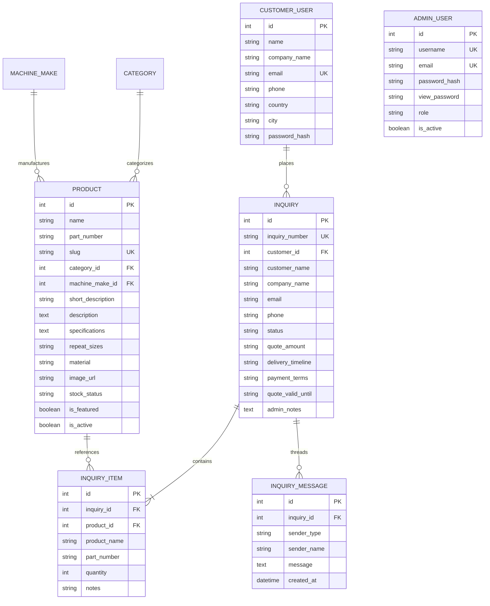

# DIVYA TRADING CO. - MASTER SYSTEM ARCHITECTURE & REPRODUCTION PROMPT

> **Project Name**: Divya Trading Co. (DTC) - Precision Rotary Printing Machine Spares B2B Platform  
> **Business Model**: B2B Industrial Spare Parts Request-For-Quote (RFQ) & Quotation Management System  
> **Tech Stack**: Python (Flask, SQLAlchemy, Werkzeug), SQLite / MySQL, Semantic HTML5, Vanilla CSS3, Vanilla Modern JavaScript, SMTP Email Engine.

---

## 🎯 Master System Prompt / Project Blueprint

```text
Act as a Principal Full-Stack Software Engineer and Industrial B2B UI/UX Architect. 
Design, build, and deploy a complete, production-ready B2B E-Commerce Catalog & Quotation Management Web Platform for "Divya Trading Co." (Ahmedabad, India) — a precision manufacturer and global exporter of textile rotary printing and processing machine spare parts since 1997.

### CORE ARCHITECTURAL REQUIREMENTS:

1. B2B NO-PRICE CATALOG & MOBILE RESPONSIVE UI:
   - High precision industrial products across 6+ machine makes (Stork RD-3/RD-4, Stormac, Pegasus, Ichinose, Reggiani, Harish, Zimmer, Stovec).
   - Prices are NOT displayed publicly. Instead, customers request formal price quotations per repeat size/quantity.
   - 2-Tier Product Descriptions: 
     * Short Description: 1-2 concise lines displayed on homepage cards and catalog grid.
     * Long Description: In-depth technical engineering overview, tolerances, and compatibility displayed on the single product detail page.
   - Stock Status Badges: 1-Click interactive toggling between "In Stock", "Out of Stock", and "Made to Order".
   - 1-Click Active/Deactive Toggle: Admin can disable any product from live public visibility with zero page refresh.
   - Mobile & Tablet Optimization: Responsive collapsible navigation, fluid product grids (1-2 cols on mobile), full-width modal fits, and touch-optimized action targets.

2. CUSTOMER AUTHENTICATION, AUTOFILL & "MY QUOTES" PORTAL:
   - Customer Registration & Sign-In (/register, /login) with automatic past inquiry linking by email.
   - Logged-in Global Autofill: All customer fields (Name, Email, Phone, Company, Country) automatically pre-fill across Quick Inquiries, Quote Cart, and Contact Us forms.
   - Contact Us Page Product Selector: Includes an optional dropdown to select any specific spare part directly from the contact form.
   - Header Navigation:
     * Guest View: Clean, uppercase "LOGIN / SIGNUP" menu item matching standard navigation links.
     * Logged-in View: Sleek circular profile icon with customer initials and dropdown menu (My Quotes & Status, Request New Quote, Sign Out).
     * Zero Admin Links: The public frontend contains zero links or mentions of the admin portal (admin is accessed directly via /admin/login).
   - Guest Inquiry Prompt: Sleek modal popup prompting guests to create an account or sign in to track quotes with real-time status, with one-click "Continue as Guest" fallback.
   - "My Quotes" Dashboard (/my-quotes):
     * Metric counters: Total Inquiries, Under Review, Quotation Ready, Completed.
     * Real-time status badges (Under Review, Quoted, Confirmed).
   - Interactive Quotation Viewer & Two-Way Chat Thread (/my-quotes/<inquiry_number>):
     * Official quotation summary card (price amount in INR/USD, dispatch timeline, payment terms, validity).
     * Live two-way discussion thread between customer and DTC sales engineering team with automated email dispatch.

3. DUAL QUOTE REQUEST FLOWS:
   - Single-Product Quick Inquiry: Modal pre-filled with product name, part number, repeat size, and quantity.
   - Multi-Product Quote List Drawer: Side drawer that collects multiple parts into a combined inquiry submission.

4. FULL-FEATURED ADMIN PANEL (/admin):
   - Inquiries & Quotation Preparation:
     * Review submitted RFQs, input formal quote price (e.g. ₹1,45,000 / $1,750 USD), lead time, payment terms, and validity.
     * Direct reply in the two-way customer discussion thread with instant email alerts.
     * CSV Export of inquiries with one click.
   - Product & Stock Manager:
     * Add/Edit products with 2-tier descriptions, part numbers, machine make, category, photos, and specs.
     * 1-Click toggles for live activation and stock status directly on the data table.
   - Customer Accounts Manager:
     * Directory of all registered textile mills, contact phone/WhatsApp, and total quotes submitted.
   - Team Roles & Password Management (Super Admin Exclusive):
     * Super Admin can assign access roles: "Super Administrator", "Sales & Quotes Manager", "Catalog & Product Editor".
     * Super Admin can view team password hints/values and update any team member's password directly.
   - Printshop-Grade Appearance & CMS Manager:
     * Tabbed controls for Hero Title/Subtitle, Brand Compatibility Pills, 4-Product Showcase limit, 6 Value Pillars, Stats ribbon, and SMTP email settings.
```

---

## 🗂️ Database Schema Overview



---

## 🌐 Complete Route Directory

| Endpoint Route | HTTP Method | Access Level | Description |
|---|---|---|---|
| `/` | `GET` | Public | Homepage with CMS-controlled hero, 4 featured products, 6 pillars, and stats |
| `/products` | `GET` | Public | Dynamic Catalog with Category/Machine filters, search, and 1-2 line short descriptions |
| `/product/<slug>` | `GET` | Public | Single product view with 2-tier descriptions, specs table, and inquiry trigger |
| `/about` | `GET` | Public | Company history since 1997, mission, quality assurance |
| `/machines` | `GET` | Public | Supported machine makes grid (Stork, Stormac, Ichinose, etc.) |
| `/download-catalog` | `GET` | Public | PDF catalog download page with inquiry trigger |
| `/contact` | `GET` | Public | Office/factory address, interactive Google Map, and contact form |
| `/login` & `/register` | `GET`, `POST` | Guest | Customer account sign-in and registration |
| `/logout` | `GET` | Customer | Customer session logout |
| `/my-quotes` | `GET` | Customer | Customer quotes dashboard with status counters and quote cards |
| `/my-quotes/<ref>` | `GET` | Customer | Full quotation breakdown and live two-way discussion thread |
| `/my-quotes/<ref>/comment` | `POST` | Customer | Post comment/reply to DTC sales engineers |
| `/api/inquire` | `POST` | Public / Customer | Single product quick inquiry submission API |
| `/api/inquiry-cart/submit` | `POST` | Public / Customer | Multi-product quote cart submission API |
| `/admin/login` | `GET`, `POST` | Admin | Admin panel authentication |
| `/admin/dashboard` | `GET` | Admin | Inquiries management, status filters, quote amount modal, live chat |
| `/admin/inquiries/<id>/quote`| `POST` | Admin | Publish quotation pricing, delivery timeline, and email customer |
| `/admin/inquiries/<id>/comment`| `POST` | Admin | Send reply to customer inquiry message thread |
| `/admin/export/inquiries` | `GET` | Admin | Export inquiries and RFQs to CSV |
| `/admin/products` | `GET` | Admin | Product catalog table with 1-click toggles and search |
| `/admin/products/add` | `POST` | Admin | Add new spare part with short & long description |
| `/admin/products/<id>/edit` | `POST` | Admin | Update spare part details and photo |
| `/admin/products/<id>/toggle-active`| `POST` | Admin | 1-Click async toggle for live catalog visibility |
| `/admin/products/<id>/stock-status` | `POST` | Admin | 1-Click async update for stock availability |
| `/admin/customers` | `GET` | Admin | Registered customer textile mills directory |
| `/admin/users` | `GET` | Super Admin | Manage admin team accounts, roles, and view/update passwords |
| `/admin/users/add` | `POST` | Super Admin | Create new admin user with assigned role |
| `/admin/users/<id>/edit` | `POST` | Super Admin | Update admin user credentials, password, and role |
| `/admin/categories` | `GET`, `POST` | Admin | Manage product categories and machine makes |
| `/admin/settings` | `GET`, `POST` | Super Admin | Full CMS website appearance manager, banner uploads, SMTP test |
